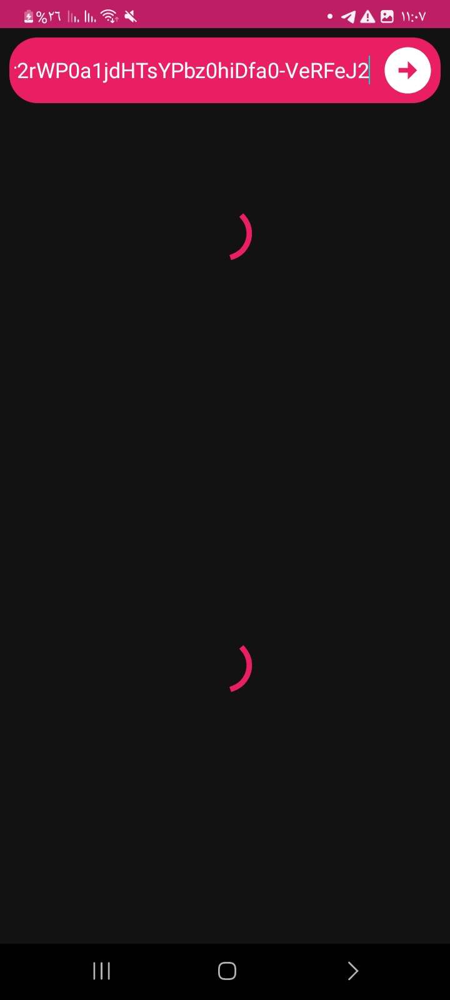

# youtube-playlist-length-android

An android application to calculate total time of a YouTube playlist [Download](https://github.com/theshoqanebi/youtube-playlist-length-android/releases/download/v1.0/app-release.apk)

build with gradle version `gradle-8.0-bin` and android gradle plugin version `8.0.1` and android studio version `Android Studio Flamingo | 2022.2.1 Patch 1`

|  |   |
| ---------------------------------------------- | -------------------------------------------- |

## License

This project is provided by [theshoqanebi](mailto:theshoqanebi@gmail.com) as open source software with the MIT license. See the [LICENSE](LICENSE.txt) file for more information.
